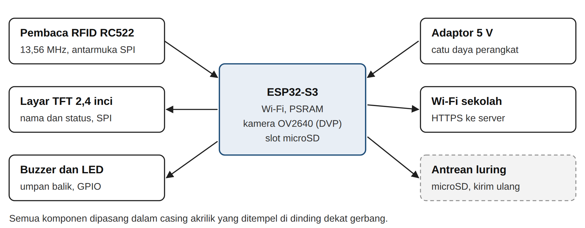

# Rancang Bangun Sistem Presensi Siswa Berlapis Berbasis Kartu Nirkontak dan Verifikasi Foto dengan Notifikasi kepada Orang Tua

*Proposal PKM Karsa Cipta (PKM-KC). Draf ke-1, 27 September 2026. Teks yang sama dengan berkas .docx; penanda **[VERIFIKASI: ...]** wajib dilengkapi tim.*

## BAB 1. PENDAHULUAN

### 1.1 Latar Belakang

Teknologi digital kini menopang banyak layanan sekolah, mulai dari pembelajaran, penilaian, sampai administrasi. Survei Asosiasi Penyelenggara Jasa Internet Indonesia mencatat penetrasi internet nasional 80,66% pada 2025 dan 84,69% di Pulau Jawa (APJII, 2025). Namun digitalisasi tidak otomatis meringankan guru. Survei terhadap 211 guru di 27 provinsi menemukan 79,1% responden merasa Platform Merdeka Mengajar menambah beban administrasi mereka (Haeri dan Afriansyah, 2024). Pelajaran dari temuan itu jelas: sistem digital untuk sekolah harus mengurangi pekerjaan guru, bukan memindahkan pekerjaan lama ke layar.

Presensi siswa termasuk pekerjaan rutin yang jarang dianggap masalah, padahal guru mengulanginya di setiap sesi pelajaran. Pada pola manual, guru memanggil nama atau mengedarkan lembar tanda tangan, wali kelas merekap catatan tiap bulan, lalu tata usaha memindahkan rekap ke rapor atau sistem informasi sekolah. Pola ini rawan salah catat dan rekap yang terlambat (Pramesti dan Febrianto, 2024), membuka peluang titip absen, dan membuat orang tua baru tahu anaknya tidak hadir setelah beberapa hari (Nugraha dan Allaami, 2025).

Data kehadiran yang akurat penting karena kehadiran berhubungan langsung dengan hasil belajar. Gottfried (2010) menunjukkan, dengan pendekatan variabel instrumental pada data sekolah di Philadelphia, bahwa jumlah hari hadir berpengaruh positif terhadap prestasi siswa. Informasi kehadiran yang sampai ke orang tua juga terbukti mengubah perilaku. Pesan otomatis mingguan kepada orang tua tentang tugas, nilai, dan ketidakhadiran menaikkan kehadiran kelas 12% dan menurunkan kegagalan mata pelajaran 27% (Bergman dan Chan, 2021). Surat berisi total ketidakhadiran anak kepada orang tua 28.080 siswa menurunkan ketidakhadiran kronis sekitar 10%, sebagian karena orang tua sebelumnya meremehkan jumlah absen anaknya (Rogers dan Feller, 2018).

Tim memilih SMA Santa Maria 1 Bandung sebagai lokasi pengembangan dan uji coba. Sekolah swasta di bawah Yayasan Salib Suci ini terdaftar sejak 25 April 1967, beralamat di Jl. Bengawan No. 6, Bandung Wetan (NPSN 20219265), dan menampung **[VERIFIKASI: ±437]** peserta didik dalam **[VERIFIKASI: 15]** rombongan belajar (Dapodik Kota Bandung, 2026; SMA Santa Maria 1 Bandung, t.t.). Observasi dan wawancara awal tim menemukan **[VERIFIKASI: isi hasil observasi awal: alur presensi saat ini, rata-rata menit presensi per sesi, lama rekap wali kelas per bulan, contoh kasus titip absen atau bolos jam pelajaran, dan cara sekolah memberi tahu orang tua]**. Sekolah juga menggunakan layanan sistem informasi sekolah AIMSIS **[VERIFIKASI: sebutkan modul yang aktif, misalnya ujian daring, nilai, atau presensi]**.

Sistem presensi berbasis kartu RFID dan notifikasi daring sudah banyak dikembangkan di Indonesia. Azmi dan Ujianto (2025) menambahkan kamera ESP32-CAM untuk menyimpan foto sebagai bukti kehadiran, dan Nugraha dan Allaami (2025) mengirim notifikasi WhatsApp kepada orang tua siswa sekolah dasar. Tiga celah masih terbuka. Pertama, presensi satu titik di gerbang tidak menangkap siswa yang hadir di sekolah tetapi meninggalkan jam pelajaran. Kedua, kartu dapat dipinjamkan, dan kartu MIFARE Classic yang umum dipakai dapat dikloning (Garcia dkk., 2008). Ketiga, notifikasi per kejadian belum memberi orang tua gambaran kumulatif yang terbukti efektif menurut Rogers dan Feller (2018).

Tim mengusulkan **Hadirku**, sistem presensi berlapis yang terdiri atas titik presensi gerbang, aplikasi web untuk sekolah, dan bot Telegram untuk orang tua. Kebaruan Hadirku terletak pada lima hal: (1) pencocokan silang presensi gerbang dan presensi kelas, dengan guru cukup mengoreksi pengecualian; (2) foto bukti di setiap penempelan kartu yang ditinjau wali kelas bersama mesin aturan anomali; (3) notifikasi waktu nyata ditambah ringkasan kumulatif mingguan; (4) rancangan yang mematuhi Undang-Undang Nomor 27 Tahun 2022 tentang Pelindungan Data Pribadi untuk data anak, tanpa pengenalan wajah otomatis; dan (5) ekspor rekap yang dapat diimpor ke sistem informasi sekolah yang sudah berjalan.

### 1.2 Rumusan Masalah

1. Bagaimana merancang mekanisme presensi berlapis yang mencatat kehadiran siswa secara otomatis serta menekan titip absen dan bolos jam pelajaran?
2. Bagaimana membangun prototipe titik presensi dan aplikasi web yang memenuhi kebutuhan guru, wali kelas, siswa, dan orang tua di SMA Santa Maria 1 Bandung?
3. Bagaimana kinerja teknis, kebergunaan, dan dampak awal sistem terhadap waktu pencatatan presensi, akurasi data kehadiran, dan keterlibatan orang tua selama uji coba?

### 1.3 Tujuan

1. Merancang mekanisme presensi berlapis gerbang dan kelas beserta aturan deteksi anomali untuk menekan kecurangan presensi.
2. Membangun prototipe fungsional berupa dua titik presensi gerbang, aplikasi web berbasis peran, dan bot Telegram, berdasarkan kebutuhan nyata SMA Santa Maria 1 Bandung.
3. Mengukur kinerja teknis, skor kebergunaan, serta perubahan waktu presensi, akurasi data, dan keterlibatan orang tua pada tiga rombongan belajar selama empat minggu uji coba.

### 1.4 Luaran

**Tabel 1.1 Luaran kegiatan**

| No | Luaran | Keterangan |
|---|---|---|
| 1 | Laporan kemajuan | Luaran wajib; memuat capaian perancangan dan implementasi |
| 2 | Laporan akhir | Luaran wajib; memuat hasil pengujian, uji coba, dan evaluasi |
| 3 | Prototipe fungsional | Luaran wajib; dua titik presensi terpasang, aplikasi web, bot Telegram, dan kode sumber |
| 4 | Akun media sosial | Luaran wajib; dokumentasi proses dan diseminasi |
| 5 | Video prototipe | Luaran wajib yang diunggah ke laman Simbelmawa **[VERIFIKASI: cek panduan terbaru]** |
| 6 | Draf artikel ilmiah | Luaran tambahan; siap dikirim ke jurnal nasional terakreditasi SINTA |
| 7 | Buku panduan pengguna | Luaran tambahan; pegangan admin, guru, dan wali kelas agar sistem tetap dipakai setelah program |

### 1.5 Manfaat

1. **Bagi guru dan sekolah:** waktu presensi per sesi berkurang, wali kelas tidak lagi merekap manual, dan sekolah memperoleh data kehadiran yang dapat diaudit.
2. **Bagi siswa dan orang tua:** orang tua mengetahui kedatangan anak pada hari yang sama dan menerima ringkasan kumulatif mingguan, sehingga dapat bertindak sebelum ketidakhadiran menumpuk.
3. **Bagi tim pengusul:** pengalaman merancang sistem perangkat keras dan perangkat lunak untuk pengguna nyata, termasuk tata kelola data anak.
4. **Bagi ilmu pengetahuan dan masyarakat:** model presensi berlapis berbiaya rendah yang terdokumentasi, dapat ditiru sekolah lain, dan menyumbang bukti lapangan dari konteks sekolah Indonesia.

## BAB 2. TINJAUAN PUSTAKA

### 2.1 Kehadiran Siswa dan Hasil Belajar

Gottfried (2010) menguji hubungan kehadiran dan prestasi pada siswa sekolah dasar dan menengah pertama di Philadelphia dengan model efek tetap dan variabel instrumental, dan menemukan pengaruh positif jumlah hari hadir terhadap hasil belajar. Meta-analisis Credé dkk. (2010) di tingkat perguruan tinggi menunjukkan korelasi kehadiran dengan nilai mata kuliah sebesar ρ = 0,44 dan dengan IPK sebesar ρ = 0,41, lebih kuat daripada prediktor lain seperti nilai tes masuk. Balfanz dan Byrnes (2012) mendefinisikan ketidakhadiran kronis sebagai absen sedikitnya 10% hari sekolah dan memperkirakan 5 sampai 7,5 juta siswa di Amerika Serikat masuk kategori ini setiap tahun. Temuan ini menjadi dasar Hadirku menghitung persentase ketidakhadiran kumulatif dan memberi peringatan dini kepada wali kelas.

### 2.2 Presensi Konvensional dan Kendalanya

Presensi manual bergantung pada ketelitian guru di setiap sesi. Pramesti dan Febrianto (2024) melaporkan bahwa pencatatan manual di sekolah dasar rawan kesalahan dan memakan waktu, dan penerapan presensi digital berbasis AppSheet mengurangi kesalahan pencatatan serta waktu administrasi kehadiran guru. Pada presensi siswa, Nugraha dan Allaami (2025) mencatat celah ketika siswa tidak hadir tanpa sepengetahuan orang tua karena informasi dari buku presensi tidak sampai tepat waktu.

### 2.3 Sistem Presensi Digital Terdahulu

Tabel 2.1 merangkum penelitian yang paling dekat dengan usulan ini. Secara teknologi, sekolah dapat memakai kode QR, kartu RFID, sidik jari, atau pengenalan wajah. Kode QR bergantung pada ponsel siswa, sedangkan hampir seperenam negara telah melarang ponsel di sekolah (UNESCO, 2023). Sidik jari dan pengenalan wajah memproses data biometrik yang termasuk data pribadi bersifat spesifik (UU No. 27 Tahun 2022, Pasal 4) dan memerlukan penilaian dampak pelindungan data (Pasal 34). Kartu RFID 13,56 MHz murah dan cepat, tetapi kartu dapat dipinjamkan atau dikloning. Hadirku memakai kartu RFID sebagai identitas dan menutup kelemahannya dengan foto bukti serta pencocokan silang di kelas.

**Tabel 2.1 Penelitian terdahulu dan posisi usulan**

| Penelitian | Teknologi dan konteks | Temuan dan relevansi |
|---|---|---|
| Winata dkk. (2021) | Aplikasi web presensi siswa, SMK | Mengembangkan presensi siswa berbasis web; menjadi acuan modul presensi kelas |
| Pramesti dan Febrianto (2024) | AppSheet, presensi guru SD | Kesalahan pencatatan dan waktu administrasi berkurang setelah digitalisasi |
| Azmi dan Ujianto (2025) | RFID + ESP32-CAM, notifikasi waktu nyata | Foto tersimpan sebagai bukti kehadiran untuk meminimalkan kecurangan; Hadirku menambah audit dan pencocokan silang |
| Nugraha dan Allaami (2025) | RFID + ESP32 + WhatsApp, SDN 2 Astanajapura | Notifikasi kepada orang tua diuji langsung di sekolah; Hadirku menambah ringkasan kumulatif |
| Usulan ini (Hadirku) | RFID + kamera + web + Telegram, SMA | Presensi berlapis gerbang dan kelas, aturan anomali, log audit, ringkasan mingguan, kepatuhan UU PDP |

### 2.4 Keterlibatan Orang Tua melalui Informasi Kehadiran

Bergman dan Chan (2021) menghubungkan sistem informasi sekolah dengan layanan pesan singkat untuk mengirim peringatan otomatis mingguan kepada orang tua siswa sekolah menengah. Intervensi itu menaikkan kehadiran kelas 12% dengan biaya kurang dari 63 dolar AS untuk lebih dari 32.000 pesan dalam setahun. Rogers dan Feller (2018) menunjukkan bahwa orang tua cenderung meremehkan total absen anaknya, dan informasi kumulatif mengoreksi keyakinan itu. Dua temuan ini menjadi dasar desain notifikasi Hadirku: pesan waktu nyata untuk kejadian harian dan ringkasan kumulatif setiap pekan. Tim memakai Telegram Bot API karena layanan ini resmi, tidak memungut biaya per pesan, dan mendukung pengiriman teks serta berkas (Telegram, 2026).

### 2.5 Keamanan Kartu dan Pelindungan Data Anak

Garcia dkk. (2008) membongkar algoritma kriptografi Crypto-1 pada kartu MIFARE Classic dan menunjukkan bahwa isi kartu dapat dibaca dan dikloning. Karena itu, Hadirku tidak menganggap UID kartu sebagai bukti identitas yang cukup. Dari sisi regulasi, UU No. 27 Tahun 2022 menggolongkan data anak dan data biometrik sebagai data pribadi spesifik (Pasal 4), mewajibkan persetujuan orang tua atau wali untuk memproses data anak (Pasal 25), dan mewajibkan penilaian dampak untuk pemrosesan berisiko tinggi seperti pemantauan sistematis (Pasal 34). Laporan UNESCO (2023) menambahkan bahwa hanya 16% negara yang menjamin privasi data pendidikan melalui undang-undang, sehingga sekolah perlu menerapkan pengamanan sejak tahap desain.

## BAB 3. TAHAP PELAKSANAAN

Tim memakai model *prototyping* iteratif (Pressman dan Maxim, 2020): tim membangun versi awal dengan cepat, meminta umpan balik pengguna, lalu memperbaiki rancangan. Gambar 3.1 memperlihatkan delapan tahap selama empat bulan.

*Gambar 3.1 Alur tahap pelaksanaan*

### 3.1 Persiapan dan Perizinan

Tim memperoleh surat kesediaan dari kepala sekolah, menetapkan tiga rombongan belajar uji coba bersama wakil kepala sekolah, dan mengedarkan formulir persetujuan kepada orang tua siswa di rombel tersebut sesuai Pasal 25 UU PDP. Tim juga menyusun penilaian dampak pelindungan data sederhana yang memuat jenis data, tujuan, retensi, hak akses, dan mitigasi risiko.

### 3.2 Analisis Kebutuhan

Tim mewawancarai wakil kepala sekolah, guru mata pelajaran, wali kelas, guru BK, dan tata usaha, lalu menyebar kuesioner singkat kepada orang tua. Tim mengukur kondisi awal dengan stopwatch pada sedikitnya 10 sesi pelajaran untuk mendapatkan rata-rata waktu presensi manual, dan mencocokkan catatan presensi dengan observasi langsung untuk mendapatkan akurasi awal. Tahap ini menghasilkan dokumen kebutuhan fungsional dan nonfungsional serta data dasar untuk evaluasi.

### 3.3 Perancangan

Tim merancang arsitektur sistem, skema basis data, aturan anomali, dan antarmuka untuk setiap peran (Lampiran 5). Titik presensi memakai ESP32-S3 berkamera, pembaca RFID RC522, layar TFT, dan kartu microSD sebagai antrean luring. Server berjalan pada VPS di pusat data Indonesia. Aturan anomali awal mencakup: kartu tercatat di gerbang tetapi guru menandai siswa tidak ada di kelas; siswa hadir di kelas tanpa catatan gerbang; satu kartu terbaca dua kali di titik berbeda dalam selang singkat; dan penempelan di luar jam operasional. Guru dan wali kelas menilai rancangan antarmuka dalam bentuk prototipe klik sebelum tim membangun aplikasi.

### 3.4 Implementasi

Tim membangun sistem dalam siklus dua mingguan. Siklus pertama menghasilkan titik presensi yang mengirim UID dan foto ke server. Siklus kedua menghasilkan aplikasi web: presensi kelas yang terisi otomatis, antrean audit wali kelas, rekap dan ekspor CSV, serta manajemen data oleh admin. Siklus ketiga menghasilkan bot Telegram untuk notifikasi, ringkasan mingguan, dan pengajuan izin. Setiap perubahan data presensi tercatat di log audit beserta pelaku dan waktunya. Foto dihapus otomatis setelah 30 hari.

### 3.5 Pengujian

Tim menjalankan uji fungsional kotak hitam untuk setiap fitur, uji kinerja perangkat (waktu tanggap dan tingkat keberhasilan baca kartu pada 500 kali penempelan), dan uji skenario kecurangan dengan relawan: kartu dipinjamkan, kartu ditempel lalu siswa meninggalkan kelas, dan penempelan ganda. Tabel 3.1 memuat indikator dan target.

**Tabel 3.1 Indikator keberhasilan**

| Indikator | Cara ukur | Target |
|---|---|---|
| Waktu tanggap penempelan kartu sampai tampilan nama | Pencatat waktu di perangkat | ≤ 2 detik |
| Keberhasilan pembacaan kartu | 500 kali penempelan | ≥ 98% |
| Jeda penempelan sampai notifikasi orang tua | Log server dan Telegram | ≤ 60 detik |
| Waktu presensi per sesi pelajaran | Stopwatch, sebelum dan sesudah | Turun ≥ 50% |
| Akurasi data kehadiran | Cocokkan dengan observasi langsung | ≥ 98% |
| Skenario kecurangan terdeteksi | Uji skenario dengan relawan | ≥ 90% skenario |
| Skor kebergunaan (SUS) guru dan orang tua | Kuesioner SUS | ≥ 68 |
| Orang tua rombel uji coba yang terhubung ke bot | Data bot | ≥ 70% |

### 3.6 Uji Coba Lapangan dan Evaluasi

Tim memasang dua titik presensi di gerbang dan menjalankan sistem pada tiga rombel selama empat minggu dengan desain sebelum dan sesudah. Tim mengukur ulang waktu presensi dan akurasi data, lalu menyebar kuesioner *System Usability Scale* (SUS) kepada guru dan orang tua. SUS terdiri atas 10 butir dengan skor 0 sampai 100 (Brooke, 1996); tim menafsirkan skor dengan skala kata sifat Bangor dkk. (2009) dan memakai nilai 68 sebagai acuan rata-rata (Lewis dan Sauro, 2018). Wawancara dengan guru, wali kelas, siswa, dan orang tua melengkapi data kuantitatif untuk menjawab rumusan masalah ketiga.

### 3.7 Pemeliharaan, Serah Terima, dan Keberlanjutan

Selama uji coba tim memperbaiki galat dan menyesuaikan aturan anomali berdasarkan temuan lapangan. Pada bulan keempat tim melatih admin tata usaha dan wali kelas, menyerahkan buku panduan, akun admin, dan kode sumber, serta menyusun rencana perluasan ke seluruh rombel. Setelah program, sekolah hanya menanggung biaya kartu untuk siswa baru dan sewa server bulanan.

### 3.8 Pelaporan dan Luaran

Tim menyusun laporan kemajuan pada bulan kedua dan laporan akhir pada bulan keempat, mengunggah video prototipe, mengelola akun media sosial sepanjang program, dan menyiapkan draf artikel ilmiah dari hasil uji coba.

## BAB 4. BIAYA DAN JADWAL KEGIATAN

### 4.1 Anggaran Biaya

Dana Belmawa Rp6.300.000, dana perguruan tinggi Rp2.000.000. Porsi dana Belmawa: bahan habis pakai 51,3% (maks 60%), sewa dan jasa 13,5% (maks 15%), transportasi lokal 21% (maks 30%), lain-lain 14,3% (maks 15%). Harga satuan estimasi September 2026.

**Tabel 4.1 Rekapitulasi rencana anggaran biaya**

| No | Jenis Pengeluaran | Belmawa (Rp) | Perguruan Tinggi (Rp) | Jumlah (Rp) |
|---|---|---|---|---|
| 1 | Bahan habis pakai | 3.230.000 | - | 3.230.000 |
| 2 | Sewa dan jasa | 850.000 | 500.000 | 1.350.000 |
| 3 | Transportasi lokal | 1.320.000 | - | 1.320.000 |
| 4 | Lain-lain | 900.000 | 1.500.000 | 2.400.000 |
|  | **Jumlah** | **6.300.000** | **2.000.000** | **8.300.000** |

### 4.2 Jadwal Kegiatan

**Tabel 4.2 Jadwal kegiatan**

| No | Jenis Kegiatan | B1 | B2 | B3 | B4 | Penanggung Jawab |
|---|---|---|---|---|---|---|
| 1 | Persiapan, perizinan, dan persetujuan orang tua | ■ |  |  |  | Ketua |
| 2 | Analisis kebutuhan dan pengukuran kondisi awal | ■ |  |  |  | Anggota 4 |
| 3 | Perancangan sistem dan validasi rancangan antarmuka | ■ | ■ |  |  | Anggota 2 |
| 4 | Perakitan titik presensi dan pengembangan firmware |  | ■ |  |  | Anggota 1 |
| 5 | Pengembangan server, aplikasi web, dan bot Telegram |  | ■ | ■ |  | Ketua |
| 6 | Pengujian fungsional, kinerja, dan skenario kecurangan |  |  | ■ |  | Anggota 3 |
| 7 | Instalasi dan uji coba lapangan (4 minggu) |  |  | ■ | ■ | Anggota 1 |
| 8 | Evaluasi kebergunaan dan dampak awal |  |  |  | ■ | Anggota 4 |
| 9 | Perbaikan, pelatihan, dan serah terima |  |  |  | ■ | Ketua |
| 10 | Penyusunan laporan kemajuan |  | ■ |  |  | Ketua |
| 11 | Laporan akhir, video prototipe, dan draf artikel |  |  |  | ■ | Ketua |
| 12 | Pengelolaan akun media sosial | ■ | ■ | ■ | ■ | Anggota 2 |

## DAFTAR PUSTAKA

- APJII (2025) *Survei Penetrasi Internet Indonesia 2025*. Jakarta: Asosiasi Penyelenggara Jasa Internet Indonesia. Tersedia di: https://survei.apjii.or.id/ (Diakses: 27 September 2026).
- Azmi, F.I. dan Ujianto, E.I.H. (2025) ‘Sistem absensi otomatis menggunakan RFID dan ESP32-CAM dengan real-time notification’, *Jurnal Sistem Komputer dan Informatika (JSON)*, 7(2), hlm. 479–489. doi:10.30865/json.v7i2.9312.
- Balfanz, R. dan Byrnes, V. (2012) *The Importance of Being in School: A Report on Absenteeism in the Nation’s Public Schools*. Baltimore: Johns Hopkins University Center for Social Organization of Schools.
- Bangor, A., Kortum, P. dan Miller, J. (2009) ‘Determining what individual SUS scores mean: adding an adjective rating scale’, *Journal of Usability Studies*, 4(3), hlm. 114–123.
- Bergman, P. dan Chan, E.W. (2021) ‘Leveraging parents through low-cost technology: the impact of high-frequency information on student achievement’, *Journal of Human Resources*, 56(1), hlm. 125–158.
- Brooke, J. (1996) ‘SUS: a “quick and dirty” usability scale’, dalam Jordan, P.W., Thomas, B., Weerdmeester, B.A. dan McClelland, I.L. (ed.) *Usability Evaluation in Industry*. London: Taylor & Francis, hlm. 189–194.
- Credé, M., Roch, S.G. dan Kieszczynka, U.M. (2010) ‘Class attendance in college: a meta-analytic review of the relationship of class attendance with grades and student characteristics’, *Review of Educational Research*, 80(2), hlm. 272–295. doi:10.3102/0034654310362998.
- Dapodik Kota Bandung (2026) *Profil SMAS St Maria 1 Bandung (NPSN 20219265)*. Tersedia di: https://simdik.bandung.go.id/npsn/20219265 (Diakses: 27 September 2026).
- Garcia, F.D., de Koning Gans, G., Muijrers, R., van Rossum, P., Verdult, R., Wichers Schreur, R. dan Jacobs, B. (2008) ‘Dismantling MIFARE Classic’, dalam *Computer Security – ESORICS 2008*. Lecture Notes in Computer Science, 5283. Berlin: Springer, hlm. 97–114.
- Gottfried, M.A. (2010) ‘Evaluating the relationship between student attendance and achievement in urban elementary and middle schools: an instrumental variables approach’, *American Educational Research Journal*, 47(2), hlm. 434–465. doi:10.3102/0002831209350494.
- Haeri, I.Z. dan Afriansyah, A. (2024) ‘Eksplorasi beban digital guru: survei pemanfaatan Platform Merdeka Mengajar (PMM) oleh guru’, *Aspirasi: Jurnal Masalah-Masalah Sosial*, 15(2), hlm. 189–206. doi:10.46807/aspirasi.v15i2.4615.
- Lewis, J.R. dan Sauro, J. (2018) ‘Item benchmarks for the System Usability Scale’, *Journal of Usability Studies*, 13(3), hlm. 158–167.
- Nugraha dan Allaami (2025) ‘Penerapan sistem absensi RFID dengan integrasi notifikasi WhatsApp untuk orang tua pada SDN 2 Astanajapura’, *Jurnal Pengembangan Teknologi, Ekonomi dan Bisnis Digital (JUTEKOBID)*, 1(1), hlm. 49–54. **[VERIFIKASI: lengkapi inisial nama penulis]**
- Pramesti, S. dan Febrianto, P.T. (2024) ‘Implementasi sistem absensi digital untuk meningkatkan efisiensi pencatatan kehadiran guru di sekolah dasar’, *JATI (Jurnal Mahasiswa Teknik Informatika)*, 8(2), hlm. 2429–2434.
- Pressman, R.S. dan Maxim, B.R. (2020) *Software Engineering: A Practitioner’s Approach*. Edisi ke-9. New York: McGraw-Hill Education.
- Republik Indonesia (2022) *Undang-Undang Nomor 27 Tahun 2022 tentang Pelindungan Data Pribadi*. Jakarta: Sekretariat Negara. Tersedia di: https://peraturan.bpk.go.id/Details/229798/uu-no-27-tahun-2022 (Diakses: 27 September 2026).
- Rogers, T. dan Feller, A. (2018) ‘Reducing student absences at scale by targeting parents’ misbeliefs’, *Nature Human Behaviour*, 2, hlm. 335–342.
- SMA Santa Maria 1 Bandung (t.t.) *Sejarah*. Tersedia di: https://smasantamaria1.sch.id/?page_id=3434 (Diakses: 27 September 2026).
- Telegram (2026) *Telegram Bot API*. Tersedia di: https://core.telegram.org/bots/api (Diakses: 27 September 2026).
- UNESCO (2023) *Global Education Monitoring Report 2023: Technology in Education, a Tool on Whose Terms?* Paris: UNESCO. Tersedia di: https://www.unesco.org/gem-report/en/publication/technology (Diakses: 27 September 2026).
- Winata, M.H., Febiyanti, Nuliyani dan Fajriani, A. (2021) ‘Pengembangan absensi siswa berbasis aplikasi web di sekolah menengah kejuruan’, *Decode: Jurnal Pendidikan Teknologi Informasi*, 1(2), hlm. 69–75. doi:10.51454/decode.v1i2.26.

## LAMPIRAN

### Lampiran 2. Justifikasi Anggaran Kegiatan

| Pos | Jenis Pengeluaran | Sumber | Volume | Harga Satuan (Rp) | Nilai (Rp) |
|---|---|---|---|---|---|
| Bahan habis pakai | Papan ESP32-S3 dengan kamera OV2640 dan slot microSD (Otak titik presensi dan pemotret bukti (2 terpasang, 1 cadangan)) | Belmawa | 3 unit | 175.000 | 525.000 |
| Bahan habis pakai | Modul pembaca RFID RC522 13,56 MHz (Membaca UID kartu siswa) | Belmawa | 3 unit | 30.000 | 90.000 |
| Bahan habis pakai | Layar TFT 2,4 inci SPI (Menampilkan nama dan status presensi) | Belmawa | 3 unit | 75.000 | 225.000 |
| Bahan habis pakai | Kartu RFID MIFARE S50 cetak identitas (Kartu siswa 3 rombel uji coba, guru, dan cadangan) | Belmawa | 120 keping | 8.500 | 1.020.000 |
| Bahan habis pakai | Kartu microSD 32 GB (Antrean luring saat Wi-Fi terputus) | Belmawa | 3 keping | 60.000 | 180.000 |
| Bahan habis pakai | Adaptor 5 V 3 A dan kabel daya (Catu daya titik presensi) | Belmawa | 3 set | 60.000 | 180.000 |
| Bahan habis pakai | Komponen pendukung (buzzer, LED, resistor, PCB, kabel jumper, header) (Perakitan rangkaian) | Belmawa | 3 paket | 60.000 | 180.000 |
| Bahan habis pakai | Casing akrilik potong laser beserta baut (Pelindung perangkat di area gerbang) | Belmawa | 3 unit | 150.000 | 450.000 |
| Bahan habis pakai | Braket dinding, kabel ties, dan duct kabel (Pemasangan di gerbang) | Belmawa | 2 set | 50.000 | 100.000 |
| Bahan habis pakai | Kabel data USB dan modul pemrogram (Pemrograman dan pengujian perangkat) | Belmawa | 2 set | 40.000 | 80.000 |
| Bahan habis pakai | ATK dan cetak formulir persetujuan orang tua serta kuesioner (Perizinan dan evaluasi) | Belmawa | 1 paket | 200.000 | 200.000 |
| Sewa dan jasa | Sewa VPS 2 vCPU, 4 GB RAM (pusat data Indonesia) (Server aplikasi, basis data, penyimpanan foto) | Belmawa | 4 bulan | 150.000 | 600.000 |
| Sewa dan jasa | Nama domain .id (Alamat aplikasi web dan sertifikat HTTPS) | Belmawa | 1 tahun | 250.000 | 250.000 |
| Sewa dan jasa | Penggunaan laboratorium dan peralatan kampus (in kind) (Perakitan dan pengujian perangkat) | PT | 1 paket | 500.000 | 500.000 |
| Transportasi lokal | Perjalanan ke sekolah: observasi dan wawancara (4 kali x 2 orang) | Belmawa | 8 orang-kali | 30.000 | 240.000 |
| Transportasi lokal | Perjalanan ke sekolah: validasi desain dan instalasi (4 kali x 2 orang) | Belmawa | 8 orang-kali | 30.000 | 240.000 |
| Transportasi lokal | Perjalanan ke sekolah: pendampingan uji coba lapangan (12 kali x 2 orang) | Belmawa | 24 orang-kali | 30.000 | 720.000 |
| Transportasi lokal | Perjalanan ke sekolah: pelatihan dan serah terima (2 kali x 2 orang) | Belmawa | 4 orang-kali | 30.000 | 120.000 |
| Lain-lain | Paket data internet tim (Pengembangan dan pemantauan uji coba) | Belmawa | 4 bulan | 100.000 | 400.000 |
| Lain-lain | Cetak buku panduan pengguna (Pegangan admin, guru, dan wali kelas) | Belmawa | 10 eksemplar | 25.000 | 250.000 |
| Lain-lain | Cetak laporan dan dokumentasi (Laporan kemajuan dan laporan akhir) | Belmawa | 1 paket | 150.000 | 150.000 |
| Lain-lain | Meterai (Surat pernyataan dan dokumen kerja sama) | Belmawa | 10 lembar | 10.000 | 100.000 |
| Lain-lain | Biaya publikasi artikel ilmiah (estimasi) (Luaran tambahan: artikel di jurnal nasional) | PT | 1 artikel | 750.000 | 750.000 |
| Lain-lain | Konsumsi pelatihan guru dan sosialisasi orang tua (2 kegiatan x 30 orang) | PT | 60 porsi | 12.500 | 750.000 |

### Lampiran 3. Susunan Tim Pengusul dan Pembagian Tugas

| No | Nama / NIM | Program Studi | Bidang Ilmu | Jam/minggu | Uraian Tugas |
|---|---|---|---|---|---|
| 1 | Ketua: **[VERIFIKASI: Nama / NIM]** | **[VERIFIKASI: Prodi]** | Rekayasa perangkat lunak | 10 | Manajemen proyek, komunikasi dengan sekolah, pengembangan server dan basis data, penyusunan laporan |
| 2 | Anggota 1: **[VERIFIKASI: Nama / NIM]** | **[VERIFIKASI: Prodi]** | Sistem tertanam dan IoT | 10 | Perancangan dan perakitan titik presensi, firmware ESP32-S3, instalasi di gerbang |
| 3 | Anggota 2: **[VERIFIKASI: Nama / NIM]** | **[VERIFIKASI: Prodi]** | Antarmuka dan pengalaman pengguna | 10 | Rancangan antarmuka, aplikasi web sisi klien, video prototipe, akun media sosial |
| 4 | Anggota 3: **[VERIFIKASI: Nama / NIM]** | **[VERIFIKASI: Prodi]** | Pengujian perangkat lunak | 8 | Bot Telegram, uji fungsional dan kinerja, uji skenario kecurangan |
| 5 | Anggota 4: **[VERIFIKASI: Nama / NIM]** | **[VERIFIKASI: Prodi]** | Evaluasi dan metodologi | 8 | Pengukuran awal, kuesioner SUS, wawancara, analisis data, draf artikel ilmiah, buku panduan |

### Lampiran 5. Gambaran Teknologi

*Gambar L5.1 Arsitektur sistem Hadirku*

*Gambar L5.2 Alur presensi berlapis*

*Gambar L5.3 Diagram blok titik presensi*

**Tabel L5.1 Fitur per peran pengguna**

| Peran | Fitur |
|---|---|
| Siswa | Menempelkan kartu di gerbang saat datang dan pulang; melihat status di layar |
| Guru mata pelajaran | Membuka sesi, menerima daftar terisi otomatis, menandai pengecualian, konfirmasi satu kali |
| Wali kelas | Meninjau antrean anomali beserta foto, menyetujui izin/sakit, melihat rekap dan peringatan absen kumulatif |
| Guru BK | Melihat daftar siswa dengan ketidakhadiran di atas ambang, mencatat tindak lanjut |
| Kepala sekolah | Melihat dasbor kehadiran per tingkat dan rombel |
| Admin tata usaha | Mengelola data siswa, kartu, jadwal, pengguna; mengekspor rekap ke sistem sekolah |
| Orang tua / wali | Menerima notifikasi masuk dan pulang, ringkasan mingguan, mengajukan izin/sakit melalui bot |

Lampiran 1 (biodata), 4 (surat pernyataan), 6 (uji similaritas), dan 7 (surat kesediaan sekolah) berupa formulir; lihat berkas .docx.
