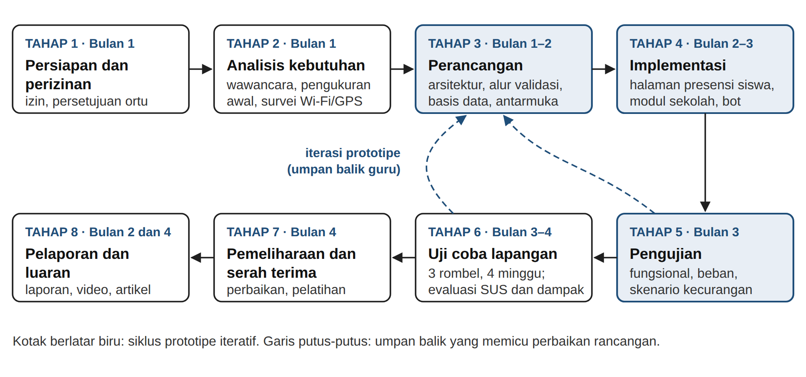
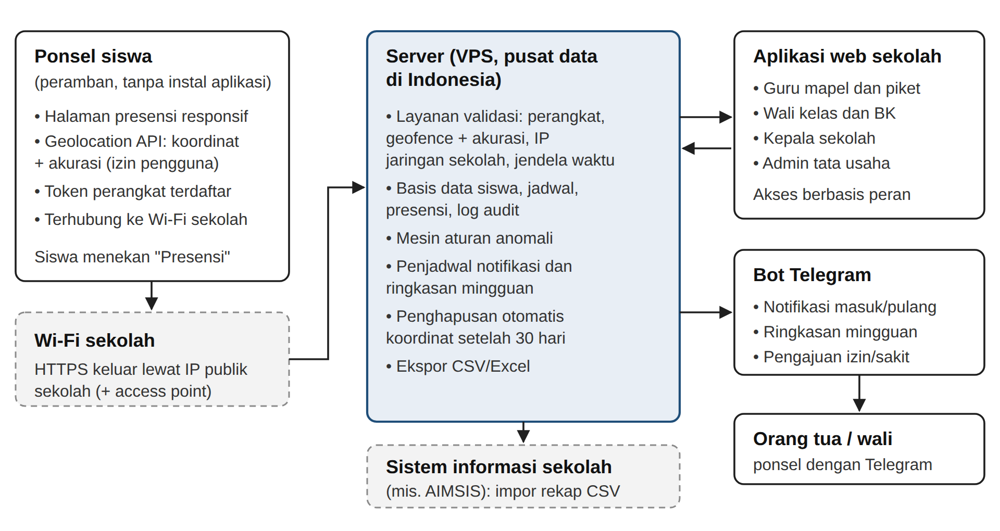
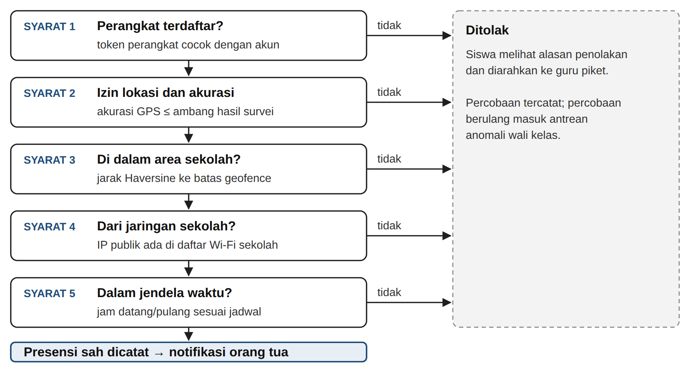
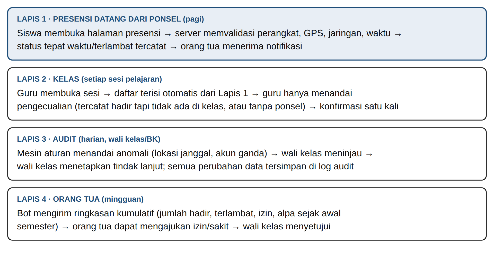

# Rancang Bangun Sistem Presensi Siswa Berbasis Web dengan Validasi Lokasi GPS dan Jaringan Sekolah serta Notifikasi kepada Orang Tua

*Proposal PKM Karsa Cipta (PKM-KC). Draf ke-1, 27 September 2026. Teks yang sama dengan berkas .docx; penanda **[VERIFIKASI: ...]** wajib dilengkapi tim.*

## BAB 1. PENDAHULUAN

### 1.1 Latar Belakang

Sekolah di Indonesia makin banyak memakai layanan digital untuk pembelajaran, penilaian, dan administrasi. Survei Asosiasi Penyelenggara Jasa Internet Indonesia mencatat penetrasi internet nasional 80,66% pada 2025 dan 84,69% di Pulau Jawa (APJII, 2025). Namun digitalisasi tidak otomatis meringankan guru. Survei terhadap 211 guru di 27 provinsi menemukan 79,1% responden merasa Platform Merdeka Mengajar menambah beban administrasi mereka (Haeri dan Afriansyah, 2024).

Presensi siswa termasuk pekerjaan rutin yang guru ulangi di setiap sesi pelajaran. Pada pola manual, guru memanggil nama atau mengedarkan lembar tanda tangan, wali kelas merekap catatan tiap bulan, lalu tata usaha memindahkan rekap ke rapor atau sistem informasi sekolah. Pola ini rawan salah catat dan rekap yang terlambat (Pramesti dan Febrianto, 2024), membuka peluang titip absen, dan membuat orang tua baru tahu anaknya tidak hadir setelah beberapa hari (Nugraha dan Allaami, 2025).

Data kehadiran yang akurat penting karena kehadiran berhubungan dengan hasil belajar. Gottfried (2010) menunjukkan, dengan pendekatan variabel instrumental pada data sekolah di Philadelphia, bahwa jumlah hari hadir berpengaruh positif terhadap prestasi siswa. Informasi kehadiran yang sampai ke orang tua juga terbukti mengubah perilaku. Pesan otomatis mingguan kepada orang tua tentang tugas, nilai, dan ketidakhadiran menaikkan kehadiran kelas 12% dan menurunkan kegagalan mata pelajaran 27% (Bergman dan Chan, 2021). Surat berisi total ketidakhadiran anak kepada orang tua 28.080 siswa menurunkan ketidakhadiran kronis sekitar 10%, sebagian karena orang tua sebelumnya meremehkan jumlah absen anaknya (Rogers dan Feller, 2018).

Tim memilih SMA Santa Maria 1 Bandung sebagai lokasi pengembangan dan uji coba. Sekolah swasta di bawah Yayasan Salib Suci ini terdaftar sejak 25 April 1967, beralamat di Jl. Bengawan No. 6, Bandung Wetan (NPSN 20219265), dan menampung **[VERIFIKASI: ±437]** peserta didik dalam **[VERIFIKASI: 15]** rombongan belajar (Dapodik Kota Bandung, 2026; SMA Santa Maria 1 Bandung, t.t.). Observasi dan wawancara awal tim menemukan **[VERIFIKASI: isi hasil observasi awal: alur presensi saat ini, rata-rata menit presensi per sesi, lama rekap wali kelas per bulan, contoh kasus titip absen atau bolos jam pelajaran, dan cara sekolah memberi tahu orang tua]**. Sekolah juga menggunakan layanan sistem informasi sekolah AIMSIS **[VERIFIKASI: sebutkan modul yang aktif, misalnya ujian daring, nilai, atau presensi]** dan menyediakan jaringan Wi-Fi **[VERIFIKASI: cakupan area dan kebijakan akses Wi-Fi siswa]**.

Penelitian terdahulu sudah memakai lokasi ponsel untuk presensi. Sudirman dkk. (2025) menerapkan *geofencing* untuk memverifikasi lokasi siswa secara waktu nyata, dan Tehamen dkk. (2026) memadukan kode QR dinamis dengan algoritma *geofencing*. Validasi yang hanya mengandalkan koordinat GPS menyisakan celah karena aplikasi pemalsu lokasi dapat mengirim koordinat palsu dari luar sekolah. Presensi di gerbang juga tidak menangkap siswa yang hadir di sekolah tetapi meninggalkan jam pelajaran. Notifikasi per kejadian juga belum memberi orang tua gambaran kumulatif, padahal informasi kumulatif itulah yang menurunkan ketidakhadiran dalam studi Rogers dan Feller (2018).

Tim mengusulkan **Hadirku**, sistem presensi berbasis web yang siswa buka melalui peramban di ponsel masing-masing, tanpa perlu memasang aplikasi. Kebaruan Hadirku terletak pada lima hal: (1) validasi ganda, yaitu posisi GPS harus berada di dalam area sekolah dan permintaan presensi harus datang dari jaringan Wi-Fi sekolah, sehingga koordinat palsu saja tidak cukup; (2) satu akun terikat pada satu perangkat terdaftar untuk menekan titip absen melalui ponsel teman; (3) pencocokan silang presensi datang dan presensi kelas, dengan guru cukup mengoreksi pengecualian; (4) notifikasi waktu nyata ditambah ringkasan kumulatif mingguan untuk orang tua; dan (5) rancangan yang mematuhi Undang-Undang Nomor 27 Tahun 2022 tentang Pelindungan Data Pribadi, termasuk pengambilan lokasi hanya pada saat presensi, bukan pelacakan terus-menerus.

### 1.2 Rumusan Masalah

1. Bagaimana merancang mekanisme presensi berbasis web yang memvalidasi lokasi GPS dan jaringan sekolah untuk menekan titip absen, pemalsuan lokasi, dan bolos jam pelajaran?
2. Bagaimana membangun prototipe aplikasi web presensi yang memenuhi kebutuhan siswa, guru, wali kelas, dan orang tua di SMA Santa Maria 1 Bandung?
3. Bagaimana kinerja teknis, kebergunaan, dan dampak awal sistem terhadap waktu pencatatan presensi, akurasi data kehadiran, dan keterlibatan orang tua selama uji coba?

### 1.3 Tujuan

1. Merancang mekanisme validasi presensi yang menggabungkan *geofencing* GPS, pemeriksaan jaringan sekolah, pengikatan perangkat, dan aturan deteksi anomali.
2. Membangun prototipe fungsional berupa aplikasi web responsif untuk siswa dan sekolah serta bot Telegram untuk orang tua, berdasarkan kebutuhan nyata SMA Santa Maria 1 Bandung.
3. Mengukur kinerja teknis, skor kebergunaan, serta perubahan waktu presensi, akurasi data, dan keterlibatan orang tua pada tiga rombongan belajar selama empat minggu uji coba.

### 1.4 Luaran

**Tabel 1.1 Luaran kegiatan**

| No | Luaran | Keterangan |
|---|---|---|
| 1 | Laporan kemajuan | Luaran wajib; memuat capaian perancangan dan implementasi |
| 2 | Laporan akhir | Luaran wajib; memuat hasil pengujian, uji coba, dan evaluasi |
| 3 | Prototipe fungsional | Luaran wajib; aplikasi web presensi yang berjalan di server, bot Telegram, dan kode sumber |
| 4 | Akun media sosial | Luaran wajib; dokumentasi proses dan diseminasi |
| 5 | Video prototipe | Luaran wajib yang diunggah ke laman Simbelmawa **[VERIFIKASI: cek panduan terbaru]** |
| 6 | Draf artikel ilmiah | Luaran tambahan; siap dikirim ke jurnal nasional terakreditasi SINTA |
| 7 | Buku panduan pengguna | Luaran tambahan; pegangan admin, guru, dan wali kelas agar sistem tetap dipakai setelah program |

### 1.5 Manfaat

1. **Bagi guru dan sekolah:** waktu presensi per sesi berkurang, wali kelas tidak lagi merekap manual, dan sekolah memperoleh data kehadiran yang dapat diaudit tanpa membeli perangkat khusus.
2. **Bagi siswa dan orang tua:** siswa cukup menekan satu tombol di ponselnya untuk presensi; orang tua mengetahui kedatangan anak pada hari yang sama dan menerima ringkasan kumulatif mingguan.
3. **Bagi tim pengusul:** pengalaman merancang aplikasi web untuk pengguna nyata, termasuk keamanan validasi lokasi dan tata kelola data anak.
4. **Bagi ilmu pengetahuan dan masyarakat:** model presensi berbasis web berbiaya rendah yang dapat ditiru sekolah lain yang memiliki Wi-Fi.

## BAB 2. TINJAUAN PUSTAKA

### 2.1 Kehadiran Siswa dan Hasil Belajar

Gottfried (2010) menguji hubungan kehadiran dan prestasi pada siswa sekolah dasar dan menengah pertama di Philadelphia dengan model efek tetap dan variabel instrumental, dan menemukan pengaruh positif jumlah hari hadir terhadap hasil belajar. Balfanz dan Byrnes (2012) mendefinisikan ketidakhadiran kronis sebagai absen sedikitnya 10% hari sekolah. Temuan ini menjadi dasar Hadirku menghitung persentase ketidakhadiran kumulatif dan memberi peringatan dini kepada wali kelas.

### 2.2 Presensi Konvensional dan Kendalanya

Presensi manual bergantung pada ketelitian guru di setiap sesi. Pramesti dan Febrianto (2024) melaporkan bahwa pencatatan manual di sekolah dasar rawan kesalahan dan memakan waktu, dan penerapan presensi digital berbasis AppSheet mengurangi kesalahan pencatatan serta waktu administrasi kehadiran guru. Pada presensi siswa, Nugraha dan Allaami (2025) mencatat celah ketika siswa tidak hadir tanpa sepengetahuan orang tua karena informasi dari buku presensi tidak sampai tepat waktu.

### 2.3 Presensi Berbasis Lokasi dan Sistem Terdahulu

Peramban utama menyediakan Geolocation API, standar W3C yang memberi aplikasi web koordinat perangkat beserta perkiraan akurasinya dalam meter setelah pengguna memberi izin (W3C, 2024). Ponsel ber-GPS umumnya akurat dalam radius 4,9 m di ruang terbuka, dan akurasinya menurun di dekat gedung, jembatan, dan pepohonan (GPS.gov, t.t.). *Geofencing* memanfaatkan koordinat itu untuk memeriksa apakah perangkat berada di dalam batas area tertentu, biasanya dengan menghitung jarak memakai rumus Haversine (Sudirman dkk., 2025). Hadirku menetapkan radius dan ambang akurasi dari pengukuran lapangan.

Validasi lokasi dari ponsel punya kelemahan: pengguna dapat memasang aplikasi pemalsu lokasi, dan aplikasi web di peramban tidak dapat memeriksa pengaturan lokasi palsu di sistem operasi. Tehamen dkk. (2026) menambahkan kode QR dinamis sebagai lapis kedua. Hadirku memilih pemeriksaan jaringan: server hanya menerima presensi dari alamat IP publik jaringan Wi-Fi sekolah, sehingga siswa harus benar-benar berada dalam jangkauan Wi-Fi sekolah. Tabel 2.1 merangkum penelitian yang paling dekat dengan usulan ini.

**Tabel 2.1 Penelitian terdahulu dan posisi usulan**

| Penelitian | Teknologi dan konteks | Temuan dan relevansi |
|---|---|---|
| Nugraha dan Allaami (2025) | RFID + ESP32 + WhatsApp, SDN 2 Astanajapura | Notifikasi kepada orang tua diuji langsung di sekolah; memerlukan perangkat pembaca di sekolah |
| Al Ma’ruf dan Aryanto (2025) | Kode QR + geolokasi, SMK Negeri 1 Nanga Pinoh | Validasi lokasi dalam radius tertentu menekan kecurangan dan mempercepat rekap |
| Sudirman dkk. (2025) | Geofencing waktu nyata, SMK Islamic Center Baiturrahman | Verifikasi lokasi siswa disertai notifikasi kepada orang tua |
| Tehamen dkk. (2026) | QR dinamis + geofencing | Lapis kedua di luar koordinat GPS untuk memvalidasi kehadiran |
| Usulan ini (Hadirku) | Web + GPS + jaringan Wi-Fi sekolah + Telegram, SMA | Validasi lokasi dan jaringan, pengikatan perangkat, pencocokan silang kelas, log audit, ringkasan mingguan, kepatuhan UU PDP |

### 2.4 Keterlibatan Orang Tua melalui Informasi Kehadiran

Bergman dan Chan (2021) menghubungkan sistem informasi sekolah dengan layanan pesan singkat untuk mengirim peringatan otomatis mingguan kepada orang tua siswa sekolah menengah. Intervensi itu menaikkan kehadiran kelas 12% dengan biaya kurang dari 63 dolar AS untuk lebih dari 32.000 pesan dalam setahun. Rogers dan Feller (2018) menunjukkan bahwa orang tua cenderung meremehkan total absen anaknya, dan informasi kumulatif mengoreksi keyakinan itu. Dua temuan ini menjadi dasar desain notifikasi Hadirku: pesan waktu nyata untuk kejadian harian dan ringkasan kumulatif setiap pekan. Tim memakai Telegram Bot API karena layanan ini resmi, tidak memungut biaya per pesan, dan mendukung pengiriman teks serta berkas (Telegram, 2026).

### 2.5 Pelindungan Data Lokasi dan Data Anak

UU No. 27 Tahun 2022 menggolongkan data anak sebagai data pribadi spesifik (Pasal 4), mewajibkan persetujuan orang tua atau wali untuk memproses data anak (Pasal 25), dan mewajibkan penilaian dampak untuk pemrosesan berisiko tinggi seperti pemantauan sistematis (Pasal 34). Data lokasi siswa masuk kategori ini. UNESCO (2023) juga mencatat hampir seperenam negara melarang ponsel di sekolah. Karena itu Hadirku mengambil lokasi hanya pada saat siswa menekan tombol presensi, menyimpan koordinat mentah paling lama 30 hari untuk audit, dan tetap menyediakan presensi manual oleh guru bagi siswa yang tidak membawa ponsel.

## BAB 3. TAHAP PELAKSANAAN

Tim memakai model *prototyping* iteratif (Pressman dan Maxim, 2020): membangun versi awal, meminta umpan balik pengguna, lalu memperbaiki rancangan. Pelaksanaan terbagi menjadi tahap pengajuan proposal dan tahap setelah proposal diterima. Gambar 3.1 memperlihatkan tahap kedua selama empat bulan.

*Gambar 3.1 Alur tahap setelah proposal diterima*

### 3.1 Tahap Pengajuan Proposal

Sebelum mengunggah proposal, tim mewawancarai **[VERIFIKASI: pihak sekolah yang sudah ditemui]** dan mengamati presensi di **[VERIFIKASI: jumlah]** sesi pelajaran untuk merumuskan masalah pada subbab 1.1. Kepala sekolah menyatakan kesediaan menjadi lokasi uji coba (Lampiran 7). Tim menelusuri pustaka dan sistem presensi terdahulu (Bab 2), menyusun rancangan konsep beserta alur validasi (Lampiran 5), lalu menghitung anggaran dan jadwal berdasarkan harga pasar dan kalender akademik sekolah.

### 3.2 Tahap Setelah Proposal Diterima

#### 3.2.1 Persiapan dan Perizinan

Tim dan wakil kepala sekolah menyepakati aturan penggunaan ponsel untuk presensi serta menetapkan tiga rombongan belajar uji coba. Orang tua siswa di rombel tersebut menerima formulir persetujuan sesuai Pasal 25 UU PDP. Tim menyusun penilaian dampak pelindungan data yang memuat jenis data, tujuan, retensi, hak akses, dan mitigasi risiko.

#### 3.2.2 Analisis Kebutuhan dan Survei Lokasi

Tim memperdalam wawancara dengan guru, wali kelas, guru BK, dan tata usaha, lalu menyebar kuesioner kepada siswa dan orang tua tentang kepemilikan ponsel dan akses Telegram. Waktu presensi manual diukur dengan pencatat waktu pada sedikitnya 10 sesi pelajaran. Bersama pengelola jaringan sekolah, tim memetakan batas area sekolah, mengukur akurasi GPS di gerbang, lorong, dan ruang kelas dengan beberapa merek ponsel, mencatat alamat IP publik Wi-Fi sekolah, dan menguji kapasitas Wi-Fi pada jam kedatangan.

#### 3.2.3 Perancangan

Tim merancang arsitektur, skema basis data, alur validasi, aturan anomali, dan antarmuka setiap peran. Satu presensi sah jika memenuhi lima syarat: perangkat terdaftar, koordinat di dalam area sekolah, akurasi di bawah ambang, alamat IP dari jaringan sekolah, dan waktu di dalam jendela presensi. Aturan anomali awal menandai koordinat identik yang berulang, perpindahan lokasi yang tidak wajar, beberapa akun pada satu perangkat, dan siswa yang tercatat hadir tetapi tidak ada di kelas. Guru dan wali kelas menilai prototipe antarmuka interaktif sebelum pembangunan dimulai.

#### 3.2.4 Implementasi

Pembangunan berjalan dalam tiga siklus dua mingguan. Siklus pertama menghasilkan halaman presensi siswa dan layanan validasi di server. Siklus kedua menghasilkan modul sekolah: presensi kelas terisi otomatis, antrean audit wali kelas, rekap dan ekspor CSV, presensi manual oleh guru piket, dan manajemen data. Siklus ketiga menghasilkan bot Telegram untuk notifikasi, ringkasan mingguan, dan pengajuan izin. Seluruh komunikasi memakai HTTPS, dan log audit mencatat pelaku serta waktu setiap perubahan data.

#### 3.2.5 Pengujian

Pengujian mencakup uji fungsional kotak hitam, uji kompatibilitas pada beberapa peramban dan ponsel kelas bawah sampai menengah, uji beban untuk kedatangan serentak, dan uji skenario kecurangan dengan relawan: presensi dari luar sekolah melalui data seluler, memakai aplikasi pemalsu lokasi, memakai akun teman di ponsel lain, dan meninggalkan kelas setelah presensi. Tabel 3.1 memuat indikator dan target.

**Tabel 3.1 Indikator keberhasilan**

| Indikator | Cara ukur | Target |
|---|---|---|
| Waktu dari membuka halaman sampai presensi tercatat | Log server | Median ≤ 15 detik |
| Presensi sah dari dalam sekolah yang diterima | Uji lapangan di titik-titik sekolah | ≥ 95% |
| Presensi dari luar sekolah atau data seluler yang ditolak | Uji skenario dengan relawan | 100% |
| Skenario kecurangan terdeteksi | Uji skenario dengan relawan | ≥ 90% skenario |
| Jeda presensi sampai notifikasi orang tua | Log server dan Telegram | ≤ 60 detik |
| Waktu presensi per sesi pelajaran | Pencatat waktu, sebelum dan sesudah | Turun ≥ 50% |
| Akurasi data kehadiran | Cocokkan dengan observasi langsung | ≥ 98% |
| Skor kebergunaan (SUS) siswa, guru, orang tua | Kuesioner SUS | ≥ 68 |
| Orang tua rombel uji coba yang terhubung ke bot | Data bot | ≥ 70% |

#### 3.2.6 Uji Coba Lapangan dan Evaluasi

Sistem berjalan pada tiga rombel selama empat minggu dengan desain sebelum dan sesudah. Tim mengukur ulang waktu presensi dan akurasi data, lalu menyebar kuesioner *System Usability Scale* (SUS) kepada siswa, guru, dan orang tua. SUS terdiri atas 10 butir dengan skor 0 sampai 100 (Brooke, 1996); tim menafsirkan skor dengan skala kata sifat Bangor dkk. (2009) dan memakai nilai 68 sebagai acuan rata-rata (Lewis dan Sauro, 2018). Wawancara dengan guru, wali kelas, siswa, dan orang tua melengkapi data kuantitatif untuk menjawab rumusan masalah ketiga.

#### 3.2.7 Pemeliharaan, Serah Terima, dan Pelaporan

Selama uji coba tim memperbaiki galat serta menyesuaikan radius, ambang akurasi, dan aturan anomali. Pada bulan keempat admin tata usaha dan wali kelas mengikuti pelatihan, lalu menerima buku panduan, akun admin, dan kode sumber. Siswa memakai ponsel sendiri, sehingga perluasan ke seluruh rombel tidak memerlukan pembelian perangkat; sekolah cukup menanggung sewa server bulanan. Laporan kemajuan terbit pada bulan kedua dan laporan akhir pada bulan keempat, disertai video prototipe, akun media sosial, dan draf artikel ilmiah.

## BAB 4. BIAYA DAN JADWAL KEGIATAN

### 4.1 Anggaran Biaya

Dana Belmawa Rp5.930.000, dana perguruan tinggi Rp2.000.000. Porsi dana Belmawa: bahan habis pakai 48,1% (maks 60%), sewa dan jasa 14,3% (maks 15%), transportasi lokal 23,3% (maks 30%), lain-lain 14,3% (maks 15%). Harga satuan estimasi September 2026.

**Tabel 4.1 Rekapitulasi rencana anggaran biaya**

| No | Jenis Pengeluaran | Belmawa (Rp) | Perguruan Tinggi (Rp) | Jumlah (Rp) |
|---|---|---|---|---|
| 1 | Bahan habis pakai | 2.850.000 | - | 2.850.000 |
| 2 | Sewa dan jasa | 850.000 | 500.000 | 1.350.000 |
| 3 | Transportasi lokal | 1.380.000 | - | 1.380.000 |
| 4 | Lain-lain | 850.000 | 1.500.000 | 2.350.000 |
|  | **Jumlah** | **5.930.000** | **2.000.000** | **7.930.000** |

### 4.2 Jadwal Kegiatan

**Tabel 4.2 Jadwal kegiatan**

| No | Jenis Kegiatan | B1 | B2 | B3 | B4 | Penanggung Jawab |
|---|---|---|---|---|---|---|
| 1 | Persiapan, perizinan, dan persetujuan orang tua | ■ |  |  |  | Ketua |
| 2 | Analisis kebutuhan, survei Wi-Fi dan akurasi GPS | ■ |  |  |  | Anggota 1 |
| 3 | Perancangan sistem dan validasi rancangan antarmuka | ■ | ■ |  |  | Anggota 2 |
| 4 | Pengembangan halaman presensi siswa dan layanan validasi |  | ■ |  |  | Ketua |
| 5 | Pengembangan modul sekolah dan bot Telegram |  | ■ | ■ |  | Anggota 3 |
| 6 | Pengujian fungsional, kompatibilitas, beban, dan skenario kecurangan |  |  | ■ |  | Anggota 1 |
| 7 | Uji coba lapangan (4 minggu) |  |  | ■ | ■ | Ketua |
| 8 | Evaluasi kebergunaan dan dampak awal |  |  |  | ■ | Anggota 4 |
| 9 | Perbaikan, pelatihan, dan serah terima |  |  |  | ■ | Ketua |
| 10 | Penyusunan laporan kemajuan |  | ■ |  |  | Ketua |
| 11 | Laporan akhir, video prototipe, dan draf artikel |  |  |  | ■ | Ketua |
| 12 | Pengelolaan akun media sosial | ■ | ■ | ■ | ■ | Anggota 2 |

## DAFTAR PUSTAKA

- Al Ma’ruf, K. dan Aryanto, J. (2025) ‘Pengaruh penerapan geolocation presensi siswa SMK Negeri 1 Nanga Pinoh menggunakan QR code terhadap ketepatan waktu presensi’, *INTECOMS: Journal of Information Technology and Computer Science*, 8(5). **[VERIFIKASI: lengkapi halaman dan DOI]**
- APJII (2025) *Survei Penetrasi Internet Indonesia 2025*. Jakarta: Asosiasi Penyelenggara Jasa Internet Indonesia. Tersedia di: https://survei.apjii.or.id/ (Diakses: 27 September 2026).
- Balfanz, R. dan Byrnes, V. (2012) *The Importance of Being in School: A Report on Absenteeism in the Nation’s Public Schools*. Baltimore: Johns Hopkins University Center for Social Organization of Schools.
- Bangor, A., Kortum, P. dan Miller, J. (2009) ‘Determining what individual SUS scores mean: adding an adjective rating scale’, *Journal of Usability Studies*, 4(3), hlm. 114–123.
- Bergman, P. dan Chan, E.W. (2021) ‘Leveraging parents through low-cost technology: the impact of high-frequency information on student achievement’, *Journal of Human Resources*, 56(1), hlm. 125–158.
- Brooke, J. (1996) ‘SUS: a “quick and dirty” usability scale’, dalam Jordan, P.W., Thomas, B., Weerdmeester, B.A. dan McClelland, I.L. (ed.) *Usability Evaluation in Industry*. London: Taylor & Francis, hlm. 189–194.
- Dapodik Kota Bandung (2026) *Profil SMAS St Maria 1 Bandung (NPSN 20219265)*. Tersedia di: https://simdik.bandung.go.id/npsn/20219265 (Diakses: 27 September 2026).
- Gottfried, M.A. (2010) ‘Evaluating the relationship between student attendance and achievement in urban elementary and middle schools: an instrumental variables approach’, *American Educational Research Journal*, 47(2), hlm. 434–465. doi:10.3102/0002831209350494.
- GPS.gov (t.t.) *GPS Accuracy*. Tersedia di: https://www.gps.gov/gps-accuracy (Diakses: 27 September 2026).
- Haeri, I.Z. dan Afriansyah, A. (2024) ‘Eksplorasi beban digital guru: survei pemanfaatan Platform Merdeka Mengajar (PMM) oleh guru’, *Aspirasi: Jurnal Masalah-Masalah Sosial*, 15(2), hlm. 189–206. doi:10.46807/aspirasi.v15i2.4615.
- Lewis, J.R. dan Sauro, J. (2018) ‘Item benchmarks for the System Usability Scale’, *Journal of Usability Studies*, 13(3), hlm. 158–167.
- Nugraha dan Allaami (2025) ‘Penerapan sistem absensi RFID dengan integrasi notifikasi WhatsApp untuk orang tua pada SDN 2 Astanajapura’, *Jurnal Pengembangan Teknologi, Ekonomi dan Bisnis Digital (JUTEKOBID)*, 1(1), hlm. 49–54. **[VERIFIKASI: lengkapi inisial nama penulis]**
- Pramesti, S. dan Febrianto, P.T. (2024) ‘Implementasi sistem absensi digital untuk meningkatkan efisiensi pencatatan kehadiran guru di sekolah dasar’, *JATI (Jurnal Mahasiswa Teknik Informatika)*, 8(2), hlm. 2429–2434.
- Pressman, R.S. dan Maxim, B.R. (2020) *Software Engineering: A Practitioner’s Approach*. Edisi ke-9. New York: McGraw-Hill Education.
- Republik Indonesia (2022) *Undang-Undang Nomor 27 Tahun 2022 tentang Pelindungan Data Pribadi*. Jakarta: Sekretariat Negara. Tersedia di: https://peraturan.bpk.go.id/Details/229798/uu-no-27-tahun-2022 (Diakses: 27 September 2026).
- Rogers, T. dan Feller, A. (2018) ‘Reducing student absences at scale by targeting parents’ misbeliefs’, *Nature Human Behaviour*, 2, hlm. 335–342.
- SMA Santa Maria 1 Bandung (t.t.) *Sejarah*. Tersedia di: https://smasantamaria1.sch.id/?page_id=3434 (Diakses: 27 September 2026).
- Sudirman, B., Susatyono, J.D. dan Azhari, M.N. (2025) ‘Implementasi geofencing pada sistem presensi siswa dengan verifikasi lokasi secara real-time: studi kasus SMK Islamic Center Baiturrahman’, *Jurnal Teknik Mesin, Elektro dan Ilmu Komputer*, 5(2), hlm. 24–35. doi:10.55606/teknik.v5i2.7131.
- Tehamen, T., Mengi, L., Teksar, T., Langi, H. dan Runtuwene, S. (2026) ‘Integrasi quick response dinamis dan algoritma geofencing pada sistem presensi terpadu untuk validasi kehadiran’, *Journal of Information System Research (JOSH)*, 7(4), hlm. 1005–1014. doi:10.47065/josh.v7i4.10003.
- Telegram (2026) *Telegram Bot API*. Tersedia di: https://core.telegram.org/bots/api (Diakses: 27 September 2026).
- UNESCO (2023) *Global Education Monitoring Report 2023: Technology in Education, a Tool on Whose Terms?* Paris: UNESCO. Tersedia di: https://www.unesco.org/gem-report/en/publication/technology (Diakses: 27 September 2026).
- W3C (2024) *Geolocation API*. W3C Recommendation, 13 Juni 2024. Tersedia di: https://www.w3.org/TR/2024/REC-geolocation-20240613/ (Diakses: 27 September 2026).

## LAMPIRAN

### Lampiran 2. Justifikasi Anggaran Kegiatan

| Pos | Jenis Pengeluaran | Sumber | Volume | Harga Satuan (Rp) | Nilai (Rp) |
|---|---|---|---|---|---|
| Bahan habis pakai | Access point Wi-Fi dual-band (Memperkuat sinyal Wi-Fi sekolah di area presensi (gerbang/lobi) bila survei menemukan titik lemah) | Belmawa | 2 unit | 450.000 | 900.000 |
| Bahan habis pakai | Kabel LAN Cat6, konektor, dan aksesori pemasangan (Menghubungkan access point ke jaringan sekolah) | Belmawa | 1 paket | 200.000 | 200.000 |
| Bahan habis pakai | Ponsel Android kelas bawah (Uji kompatibilitas; setelah program menjadi perangkat presensi manual guru piket) | Belmawa | 1 unit | 1.200.000 | 1.200.000 |
| Bahan habis pakai | Cetak poster panduan presensi dan kode QR tautan halaman (Dipasang di 15 kelas, gerbang, dan ruang guru) | Belmawa | 20 lembar | 15.000 | 300.000 |
| Bahan habis pakai | ATK dan cetak formulir persetujuan orang tua serta kuesioner (Perizinan dan evaluasi) | Belmawa | 1 paket | 250.000 | 250.000 |
| Sewa dan jasa | Sewa VPS 2 vCPU, 4 GB RAM (pusat data Indonesia) (Server aplikasi web dan basis data) | Belmawa | 4 bulan | 150.000 | 600.000 |
| Sewa dan jasa | Nama domain .id (Alamat aplikasi web dan sertifikat HTTPS) | Belmawa | 1 tahun | 250.000 | 250.000 |
| Sewa dan jasa | Penggunaan laboratorium komputer kampus (in kind) (Pengembangan dan uji beban aplikasi) | PT | 1 paket | 500.000 | 500.000 |
| Transportasi lokal | Perjalanan ke sekolah: observasi dan wawancara (4 kali x 2 orang) | Belmawa | 8 orang-kali | 30.000 | 240.000 |
| Transportasi lokal | Perjalanan ke sekolah: survei Wi-Fi dan akurasi GPS (3 kali x 2 orang) | Belmawa | 6 orang-kali | 30.000 | 180.000 |
| Transportasi lokal | Perjalanan ke sekolah: validasi rancangan antarmuka (2 kali x 2 orang) | Belmawa | 4 orang-kali | 30.000 | 120.000 |
| Transportasi lokal | Perjalanan ke sekolah: pendampingan uji coba lapangan (12 kali x 2 orang) | Belmawa | 24 orang-kali | 30.000 | 720.000 |
| Transportasi lokal | Perjalanan ke sekolah: pelatihan dan serah terima (2 kali x 2 orang) | Belmawa | 4 orang-kali | 30.000 | 120.000 |
| Lain-lain | Paket data internet tim (Pengembangan dan pemantauan uji coba) | Belmawa | 4 bulan | 100.000 | 400.000 |
| Lain-lain | Cetak buku panduan pengguna (Pegangan admin, guru, dan wali kelas) | Belmawa | 10 eksemplar | 25.000 | 250.000 |
| Lain-lain | Cetak laporan dan dokumentasi (Laporan kemajuan dan laporan akhir) | Belmawa | 1 paket | 100.000 | 100.000 |
| Lain-lain | Meterai (Surat pernyataan dan dokumen kerja sama) | Belmawa | 10 lembar | 10.000 | 100.000 |
| Lain-lain | Biaya publikasi artikel ilmiah (estimasi) (Luaran tambahan: artikel di jurnal nasional) | PT | 1 artikel | 750.000 | 750.000 |
| Lain-lain | Konsumsi pelatihan guru dan sosialisasi orang tua (2 kegiatan x 30 orang) | PT | 60 porsi | 12.500 | 750.000 |

### Lampiran 3. Susunan Tim Pengusul dan Pembagian Tugas

| No | Nama / NIM | Program Studi | Bidang Ilmu | Jam/minggu | Uraian Tugas |
|---|---|---|---|---|---|
| 1 | Ketua: **[VERIFIKASI: Nama / NIM]** | **[VERIFIKASI: Prodi]** | Rekayasa perangkat lunak | 10 | Manajemen proyek, komunikasi dengan sekolah, pengembangan server, basis data, dan layanan validasi, penyusunan laporan |
| 2 | Anggota 1: **[VERIFIKASI: Nama / NIM]** | **[VERIFIKASI: Prodi]** | Jaringan dan keamanan informasi | 10 | Survei Wi-Fi dan akurasi GPS, konfigurasi validasi jaringan dan geofence, pengamanan server, uji skenario kecurangan |
| 3 | Anggota 2: **[VERIFIKASI: Nama / NIM]** | **[VERIFIKASI: Prodi]** | Antarmuka dan pengalaman pengguna | 10 | Rancangan antarmuka, aplikasi web sisi klien, video prototipe, akun media sosial |
| 4 | Anggota 3: **[VERIFIKASI: Nama / NIM]** | **[VERIFIKASI: Prodi]** | Pengujian perangkat lunak | 8 | Bot Telegram, uji fungsional, kompatibilitas, dan beban |
| 5 | Anggota 4: **[VERIFIKASI: Nama / NIM]** | **[VERIFIKASI: Prodi]** | Evaluasi dan metodologi | 8 | Pengukuran awal, kuesioner SUS, wawancara, analisis data, draf artikel ilmiah, buku panduan |

### Lampiran 5. Gambaran Teknologi

*Gambar L5.1 Arsitektur sistem Hadirku*

*Gambar L5.2 Alur validasi satu presensi*

*Gambar L5.3 Alur presensi berlapis*

**Tabel L5.1 Fitur per peran pengguna**

| Peran | Fitur |
|---|---|
| Siswa | Membuka halaman presensi di ponsel saat datang dan pulang; melihat riwayat kehadiran sendiri |
| Guru mata pelajaran | Membuka sesi, menerima daftar terisi otomatis, menandai pengecualian, konfirmasi satu kali |
| Guru piket | Mencatat presensi manual siswa tanpa ponsel atau dengan ponsel bermasalah; tercatat di log audit |
| Wali kelas | Meninjau antrean anomali, menyetujui ganti perangkat dan izin/sakit, melihat rekap dan peringatan absen kumulatif |
| Guru BK | Melihat daftar siswa dengan ketidakhadiran di atas ambang, mencatat tindak lanjut |
| Kepala sekolah | Melihat dasbor kehadiran per tingkat dan rombel |
| Admin tata usaha | Mengelola data siswa, jadwal, pengguna, batas area sekolah, dan daftar IP jaringan; mengekspor rekap ke sistem sekolah |
| Orang tua / wali | Menerima notifikasi masuk dan pulang, ringkasan mingguan, mengajukan izin/sakit melalui bot |

Lampiran 1 (biodata), 4 (surat pernyataan), 6 (uji similaritas), dan 7 (surat kesediaan sekolah) berupa formulir; lihat berkas .docx.
